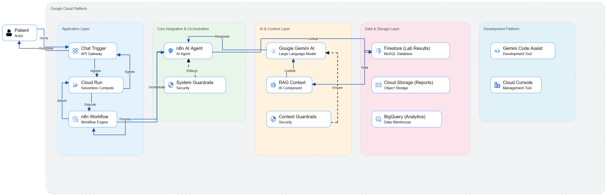

# HealthSpeak AI

## Why HealthSpeak AI?

Finding a lab value should not require digging through EMRs. HealthSpeak AI gives patients and staff a conversational way to pull exact results instantly, reducing effort and miscommunication.

***

## Story

HealthSpeak AI addresses the pain of accessing lab data quickly. Instead of complex interfaces or ambiguous interpretations, it quotes exact values from medical records using an orchestrated workflow on Google Cloud Run, Firestore, and Google Gemini AI. The result is fast, trustworthy responses for patients and clinicians.

***

## Overview

HealthSpeak AI is a conversational assistant that returns exact lab values from medical records in response to natural language questions—without interpretation or advice.

### Key Features

- Natural language questions like "What is my HbA1c?" or "Show all my lab results"
- Uses n8n workflow to connect chat trigger, Firestore database, and Gemini AI
- Outputs only verifiable lab data with dates, avoiding medical advice
- Supports patients and healthcare staff for efficient result communication
- Runs serverless on Google Cloud Run for easy scaling and maintenance

***

## How It Works

1) User asks a question in chat.  
2) n8n workflow triggers the AI Agent.  
3) Agent fetches lab data from Firestore and injects it into the prompt with guardrails.  
4) Gemini returns quoted results (single line or numbered list).  
5) Response is sent back to the user.

***

## Limitations \& Next Steps

- Focused exclusively on data quoting; no clinical interpretation or recommendations.
- Demo version assumes single-patient context without user authentication.
- Planned expansions include multi-patient support, patient authentication, and multilingual capabilities.

## Architecture Diagram



## HealthSpeak AI - Reference Architecture Context

### Core Architecture Summary
AI-powered patient chatbot on Google Cloud Run with Firestore as the source of truth for lab data.

### Layers at a Glance
- **Application:** n8n workflow on Cloud Run; chat trigger as the entry point.  
- **Orchestration:** n8n AI Agent with system guardrails enforcing quote-only responses.  
- **Data:** Firestore `healthspeak/patients/lab_results` JSON (e.g., `"HbA1c": "5.8% (Jul 6, 2025)"`).  
- **AI:** Google Gemini with RAG-style context injection from Firestore; safety prompts for HIPAA compliance.  
- **Ops:** Cloud Run autoscaling; n8n background jobs; managed via Google Cloud Console.  
- **Future Expansion:** Cloud Storage for documents; BigQuery for analytics.

### End-to-End Flow
```
Patient query ("What is my HbA1c?")
    ↓ chat trigger (Cloud Run)
AI Agent → Firestore lookup (lab_results)
    ↓ prompt with guardrails + Firestore context
Gemini returns quoted result
    ↓
Response to user: "HbA1c: 5.8% (Jul 6, 2025) from your medical records."
```

### Key Benefits
- Serverless and scalable (autoscale without infra management)
- HIPAA-safe framing: quote-only, no advice
- Cost-effective pay-per-use

## Project Artifacts

- [HealthSpeak Workflow JSON](healthspeak-ai.json)
- [User Requirements Specification (URS)](URS.md)
- [Software Requirements Specification (SRS)](SRS.md)
- [Functional Specification Document (FSD)](FSD.md)
- [Technical Specification Document (TSD)](TSD.md)
- [Test Plan](Test%20Plan.md)
- [User Acceptance Test (UAT)](UAT.md)
- [Deployment Plan](Deployment%20Plan.md)
- [User Manual](User%20Manual.md)
- [Maintenance Plan](MaintenancevPlan.md)
